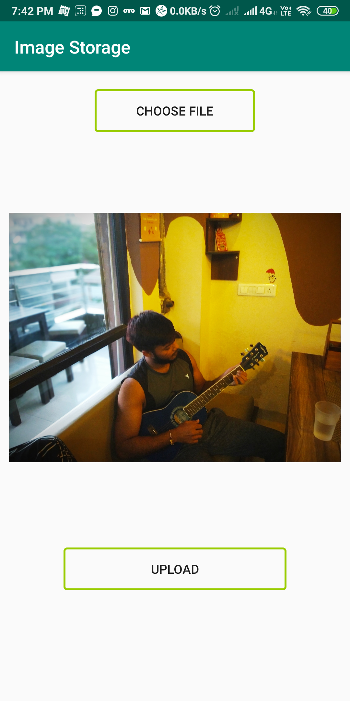

# About
### It is an app which is used to take an image from a device and upload it to the database.

## Screenshot

# Tech Stack
#### It uses database and storage access using Firebase to upload an image.
#### It uses an access to the device storage to choose pic ,one at a time.